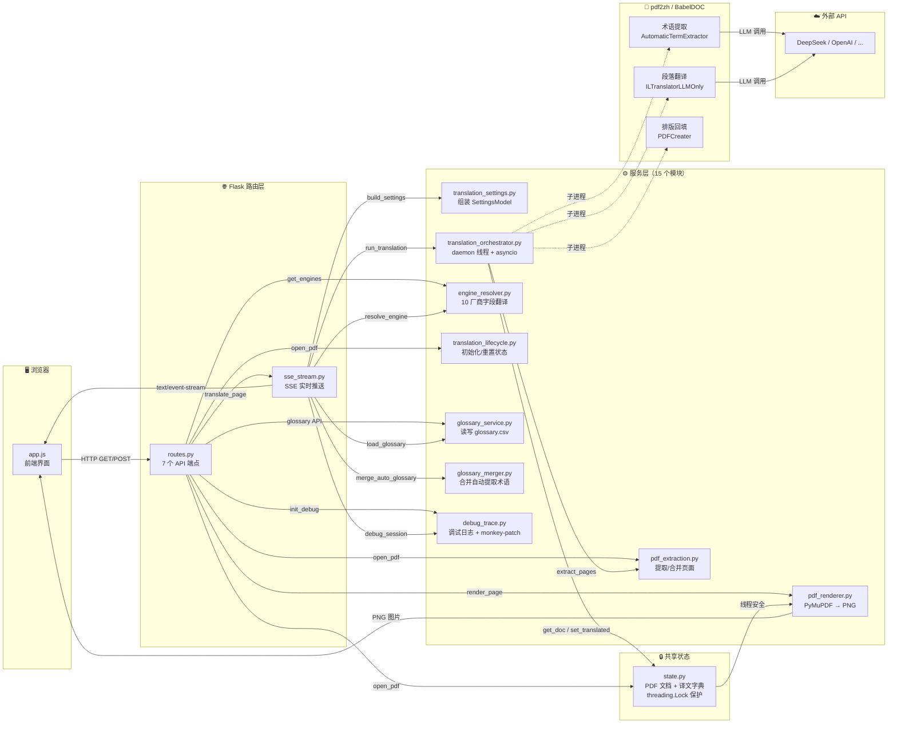

# PDF Reader 模块交互图

<!-- HISTORICAL_DOCUMENT_START -->
> [!NOTE]
> **历史资料。** 本文保留的是当时的阶段记录，不代表当前项目目的、当前实现或实施授权。请以 [project](../project.md)、[architecture](../architecture.md) 和 [roadmap](../roadmap.md) 为准。
<!-- HISTORICAL_DOCUMENT_END -->

> 箭头 = 调用方向。从左到右是「谁调用了谁」。



---

## 三条核心数据流

### 1. 打开 PDF

```
用户拖拽 PDF → routes.open_pdf()
    ├── pdf_extraction.extract_pages()   → 提取页面为独立文件
    ├── state.set_doc()                  → 载入 PyMuPDF 文档
    └── translation_lifecycle.init_lifecycle() → 初始化译文状态
```

### 2. 渲染页面（左右对照）

```
用户滚动 → routes.page_left() / routes.page_right()
    └── pdf_renderer.render_page()
        ├── state.get_doc()              → 获取 PDF（持锁）
        ├── doc[page_num].get_pixmap()   → PyMuPDF 渲染
        └── 返回 PNG 字节流
```

### 3. 翻译页面（最复杂）

```
用户点击翻译 → routes.translate_page()
    └── sse_stream.do_translate_async_stream()
        ├── engine_resolver.resolve_engine()    → 确定 AI 引擎
        ├── translation_settings.build_settings() → 组装参数
        ├── glossary_service.load_glossary()    → 载入手动词汇表
        ├── translation_orchestrator.run_translation()
        │   ├── pdf_extraction.extract_pages()  → 准备翻译输入
        │   └── pdf2zh.high_level.translate()   → 子进程翻译
        │       ├── AutomaticTermExtractor      → 术语提取（LLM）
        │       ├── ILTranslatorLLMOnly         → 段落翻译（LLM）
        │       └── PDFCreater                  → 排版回填
        ├── state.set_translated()              → 保存译文
        ├── glossary_merger.merge_glossaries()  → 合并术语表
        └── SSE 流推送进度 → 浏览器实时更新
```

---

## 模块依赖矩阵

| 模块 | 被谁调用 | 调用了谁 |
|------|----------|----------|
| `routes.py` | 浏览器 HTTP | 所有其他模块 |
| `sse_stream.py` | `routes.py` | settings, engine, orchestrator, glossary, debug |
| `state.py` | routes, sse, orchestrator, renderer | (无) |
| `pdf_renderer.py` | `routes.py` | `state.py` |
| `translation_settings.py` | `sse_stream.py` | (无) |
| `translation_orchestrator.py` | `sse_stream.py` | state, pdf_extraction, pdf2zh |
| `engine_resolver.py` | routes, sse | (无) |
| `pdf_extraction.py` | routes, orchestrator | (无) |
| `translation_lifecycle.py` | `routes.py` | (无) |
| `glossary_service.py` | routes, sse | (无) |
| `glossary_merger.py` | `sse_stream.py` | (无) |
| `debug_trace.py` | routes, sse | (无) |
